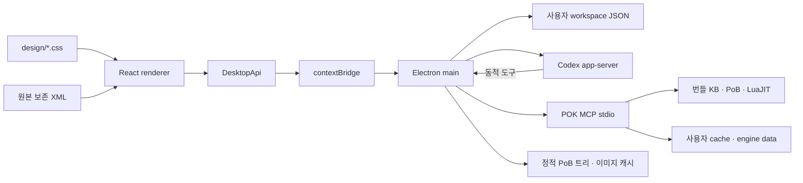

# 구조와 배포 경계

```text
Documents/
├─ poe2-ai-wiki/          # 별도 Git: KB · MCP · 결정적 계산 · 에이전트 스킬
└─ pok-ui/               # 별도 Git: 데스크톱 UI와 배포
   ├─ src/
   │  ├─ renderer/       # React 화면; 브라우저 API만 사용
   │  │  ├─ design/      # tokens / layout / components CSS
   │  │  ├─ components/ # 공통 능력치 패널
   │  │  ├─ features/   # 장비, 스킬, 트리, 설정, 채팅
   │  │  ├─ state/      # 작업 공간 편집과 저장 큐
   │  │  └─ services/   # DesktopApi 연결과 개발 미리보기 어댑터
   │  ├─ shared/        # 순수 계약, XML 문서 편집, 초기 상태
   │  ├─ preload/       # 제한된 contextBridge API
   │  └─ main/          # 파일 저장, MCP, Codex 프로세스, IPC 검증
   ├─ resources/pok-runtime/ # 생성된 엔진 배포물; gitignore
   ├─ resources/passive-tree/ # PoB 버전별 트리·변환 이미지; gitignore
   ├─ scripts/          # 개발, 빌드, 경계 검사, 런타임 준비
   ├─ tests/            # XML 보존, 저장, IPC·에이전트 동작 검증
   ├─ docs/
   ├─ dist/             # 생성된 앱 코드; gitignore
   └─ release/          # 생성된 실행 파일; gitignore
```



CSS는 데이터 계약과 독립적이다. 화면 컴포넌트를 바꾸더라도 XML 변환, MCP 연결, 파일 저장 구현은 바뀌지 않는다. `check-boundaries.mjs`로 렌더러→main 직접 접근, shared→React/Node 의존, main→renderer 역참조를 차단한다.

패시브 트리 표시는 MCP와 분리된 정적 데이터 경로다. main은 트리 JSON을 일괄 읽고 제한된 이미지 URL을 반환하며, 렌더러는 원본 궤도 좌표와 연결을 Canvas에 그린다. 트리 버전은 빌드 XML과 일치해야 한다. [변환·캐시·렌더링 상세](PASSIVE-TREE.md)

## 문서·계산

`BuildDocument.xml`은 현재 편집 정본, `originalXml`은 가져온 원본이다. XML DOM에서 요청받은 요소만 수정하므로 비활성 세트와 알려지지 않은 속성도 보존한다. 계산에만 `projectActiveXml`을 만들어 선택한 세트를 명시한다. 기존 `restore_pob_spec → compute_pob`를 사용하며 복원에서 손실된 정보와 계산 진단을 UI에 노출한다. PoB 전체 편집·복원 동등성을 주장하지 않는다.

편집마다 revision을 올리고 이전 XML을 최대 30개 저장한다. 계산 결과는 제출 시점 revision을 갖는다. 늦게 끝난 계산을 다른 편집본의 최신값으로 표시하지 않는다. AI도 `buildId + baseRevision + proposed XML`로 제안하고 검토 이후 적용한다.

## 저장·프로세스

main만 파일과 프로세스에 접근한다. 저장은 검증 후 임시 파일에 flush하고 rename한다. 종료 시 진행 중 저장을 기다린다. 손상 파일은 보존하며 무조건 빈 데이터로 덮어쓰지 않는다. 저장 버전은 `schemaVersion: 1`이며 형식 변경 시 명시적인 migration을 추가한다.

Electron은 sandbox/contextIsolation을 켜고 nodeIntegration을 끈다. preload는 정의된 API만 공개한다. main은 IPC sender·인자·문서 크기를 검사하고 임의 탐색/팝업/권한/다운로드를 차단한다.

엔진은 독립 프로세스이며 배포 실행 파일 위치와 쓰기 데이터 위치를 분리한다. 개발에서는 저장소 Python을 선택할 수 있다. 배포에서는 앱 resources 아래 frozen `pok.exe serve`를 호출하고 Python 설치를 요구하지 않는다. 앱의 모드별 어댑터가 같은 MCP 계약을 사용한다.

Codex는 설치된 CLI의 app-server 프로토콜을 사용한다. 기존 인증을 CLI가 처리하며 앱은 인증 토큰을 읽거나 저장하지 않는다. thread 재개, 메시지 스트리밍, 취소, 승인, 동적 POK 도구를 연결한다. 지원 스키마는 로컬 CLI가 생성한 protocol로 확인했고 [공식 App Server 문서](https://developers.openai.com/codex/app-server/)를 참고했다. 프로토콜 변경은 `src/main/agent.ts` 어댑터에서 처리한다. Claude 어댑터는 아직 없다.
