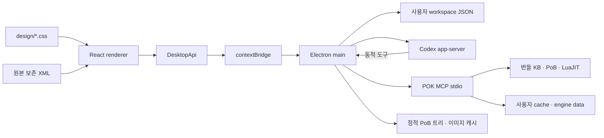

# 구조와 배포 경계

```text
Documents/
├─ poe2-ai-wiki/          # 별도 Git: KB · MCP · 결정적 계산 · 에이전트 스킬
└─ pok-ui/               # 별도 Git: 데스크톱 UI와 배포
   ├─ src/
   │  ├─ renderer/       # React 화면; 브라우저 API만 사용
   │  │  ├─ design/      # tokens / layout / components CSS
   │  │  ├─ components/ # 공통 능력치 패널
   │  │  ├─ features/   # 장비, 스킬, 트리, 설정, 채팅
   │  │  ├─ state/      # 작업 공간 편집과 저장 큐
   │  │  └─ services/   # DesktopApi 연결과 개발 미리보기 어댑터
   │  ├─ shared/        # 순수 계약, XML 문서 편집, 초기 상태
   │  ├─ preload/       # 제한된 contextBridge API
   │  └─ main/          # 파일 저장, MCP, Codex 프로세스, IPC 검증
   ├─ resources/pok-runtime/ # 생성된 엔진 배포물; gitignore
   ├─ resources/passive-tree/ # PoB 버전별 트리·변환 이미지; gitignore
   ├─ scripts/          # 개발, 빌드, 경계 검사, 런타임 준비
   ├─ tests/            # XML 보존, 저장, IPC·에이전트 동작 검증
   ├─ docs/
   ├─ dist/             # 생성된 앱 코드; gitignore
   └─ release/          # 생성된 실행 파일; gitignore
```



CSS는 데이터 계약과 독립적이다. 화면 컴포넌트를 바꾸더라도 XML 변환, MCP 연결, 파일 저장 구현은 바뀌지 않는다. `check-boundaries.mjs`로 렌더러→main 직접 접근, shared→React/Node 의존, main→renderer 역참조를 차단한다.

패시브 트리 표시는 MCP와 분리된 정적 데이터 경로다. main은 트리 JSON을 일괄 읽고 제한된 이미지 URL을 반환하며, 렌더러는 원본 궤도 좌표와 연결을 Canvas에 그린다. 트리 버전은 빌드 XML과 일치해야 한다. [변환·캐시·렌더링 상세](PASSIVE-TREE.md)

## 문서·계산

`BuildDocument.xml`은 현재 편집 정본, `originalXml`은 가져온 원본이다. XML DOM에서 요청받은 요소만 수정하므로 비활성 세트와 알려지지 않은 속성도 보존한다. 계산에만 `projectActiveXml`을 만들어 선택한 세트를 명시한다. 검증된 묶음의 `compute_pob_xml`에 선택 세트 XML을 직접 전달하고, 복원은 검사/진단에만 사용한다. 적용할 수 없는 검사는 미실행으로 구분한다. PoB 전체 편집·복원 동등성을 주장하지 않는다.

편집마다 revision을 올리고 이전 XML을 최대 30개 저장한다. 계산 결과는 제출 시점 buildId/revision/XML hash와 POK·PoB·KB를 식별하는 bundleId를 갖는다. 늦게 끝난 계산을 다른 편집본의 최신값으로 표시하지 않는다. AI도 `buildId + baseRevision + proposed XML`로 제안하고 검토 이후 적용한다.

## 저장·프로세스

main만 파일과 프로세스에 접근한다. 저장은 검증 후 임시 파일에 flush하고 rename한다. 종료 시 진행 중 저장을 기다린다. 손상 파일은 보존하며 무조건 빈 데이터로 덮어쓰지 않는다. 저장 버전은 `schemaVersion: 1`이며 형식 변경 시 명시적인 migration을 추가한다.

Electron은 sandbox/contextIsolation을 켜고 nodeIntegration을 끈다. preload는 정의된 API만 공개한다. main은 IPC sender·인자·문서 크기를 검사하고 임의 탐색/팝업/권한/다운로드를 차단한다.

엔진은 독립 프로세스이며 배포 실행 파일 위치와 쓰기 데이터 위치를 분리한다. 개발에서는 저장소 Python을 선택할 수 있다. 배포에서는 앱 resources 아래 manifest의 검증된 entrypoint로 portable Python 런타임을 호출하고 외부 Python/LuaJIT 설치를 요구하지 않는다. 앱의 모드별 어댑터가 같은 MCP 계약을 사용한다.

Codex는 설치된 CLI의 app-server 프로토콜을 사용한다. 기존 인증을 CLI가 처리하며 앱은 인증 토큰을 읽거나 저장하지 않는다. thread 재개, 메시지 스트리밍, 취소, 승인, 동적 POK 도구를 연결한다. 지원 스키마는 로컬 CLI가 생성한 protocol로 확인했고 [공식 App Server 문서](https://developers.openai.com/codex/app-server/)를 참고했다. 프로토콜 변경은 `src/main/agent.ts` 어댑터에서 처리한다. Claude 어댑터는 아직 없다.

## 고정 원본 데이터 배포

[데이터 묶음 절차](DATA-BUNDLE.md)를 따른다. `GameDataStore`가 원본 카탈로그·트리·런타임의 출처와 파일 해시를 검증하고, `PokConnection`은 검증된 실행 정보만 사용한다. 원본은 POK runtime에 한 벌이며 UI 카탈로그는 KB와 분리된 원본 추출물이다. 갱신은 빌드 전에만 수행한다.

## 채팅 입력·질문·연결 상태

Codex model/list의 모델·입력 모달리티·추론 강도를 UI에 전달한다. 이미지 원문은 main의 ChatImageStore가 형식/크기/해시를 검사하고 사용자 데이터 아래 보관한다(최대 4개, 개당 4 MiB). 렌더러와 저장 대화에는 경로 대신 불투명 ID와 메타데이터만 전달한다. 미리보기는 제한된 pok-image 프로토콜, 모델 입력은 main이 확인한 localImage 경로를 사용한다.

requestUserInput은 명시적 선택을 받은 뒤 RPC에 답한다. 비동기 질문은 턴 진행 중에는 steer, 종료 후에는 같은 대화의 새 턴으로 전달하며 종료 알림 경합에서도 답변을 보존한다. 취소 실패 시 질문과 실행 상태를 유지한다. 새 메시지에는 완료 시각과 소요 시간을 저장한다.

POK 연결 상태는 main의 실제 MCP 수명에 종속된다. 종료나 RPC 시간 초과는 즉시 연결 해제로 게시한다. 에이전트는 관리되는 동적 도구 브리지를 사용하며 독립 pok MCP 인스턴스는 비활성화한다.
