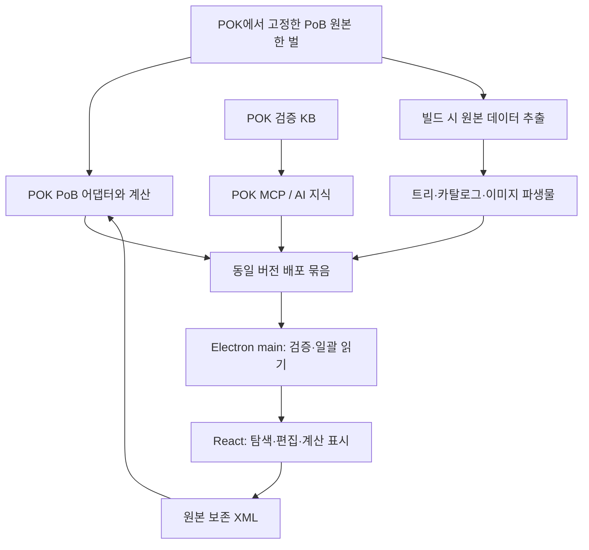
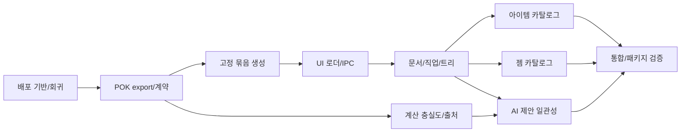

# POK 고정 PoB 기반 데스크톱 통합 구현 계획

작성: 2026-10-08
상태: 구현 전 상세 계획. 코드 구현·엔진 갱신·데이터 재수집·배포는 아직 수행하지 않았다.
기준: pok-ui `d3817f68fa6506e7a49d9a82509c01fa9a79680c`.
POK 조사 대상: 로컬 `fix/backlog-batch-0912`, `e8b31b90ba4633f6ff2b28478eea424ad6894504`. 이 브랜치를 배포 입력으로 확정한 것은 아니다.
경로 표기: UI 파일은 이 저장소 기준, `POK:`는 별도 poe2-ai-wiki 저장소 기준이다.
새 파일·도구·명령 이름은 아래에서 명시적으로 “신규/제안”으로 표시하며 기존 API로 간주하지 않는다.

## 1. 요구사항과 완료 범위

POK가 고정한 PoB 원본으로 편집 화면을 제공하고, 동일한 POK의 KB와 계산 도구를 AI 에이전트가 사용한다.
사용자와 AI는 동일한 빌드 XML을 조회·제안·편집·계산한다. 패치 갱신은 개발/빌드 단계에서 이루어지며 배포 앱은 고정된 묶음을 사용한다.

필수 원칙:

1. PoB 버전 선택권은 POK에 있다. UI가 upstream 최신 커밋을 선택하거나 별도 PoB를 내려받지 않는다.
2. 배포물의 PoB 원본은 한 벌이다. 화면용 JSON·WebP는 같은 원본에서 재생성 가능한 파생물이다.
3. UI 편집 데이터는 원본 PoB 추출 경로, AI 지식은 POK KB 경로를 사용한다. KB의 필터링·요약·병합을 원본 편집 데이터에 적용하지 않는다.
4. 계산·아이템 해석 등 게임 의미를 TypeScript로 재구현하지 않는다. 기존 POK의 PoB 어댑터를 확장한다.
5. XML이 편집 정본이다. 미지원 요소·비활성 세트·알 수 없는 속성·원문을 보존한다.
6. 새 시즌 반영은 POK 검증 버전 선택 → 원본 데이터 추출 → UI 검증 → 패키징 순서다.
7. 기존 도구·생성기·라이브러리를 재사용한다. 새 의존성 도입이 필요하면 구체적 필요성과 대안을 별도 결정 항목으로 기록하며 이 계획만으로 설치를 승인한 것으로 보지 않는다.
8. 런타임 검사는 포함된 묶음의 일관성을 확인한다. 실행 중 데이터 다운로드·업그레이드·자동 마이그레이션을 하지 않는다.

이번 구현에 포함할 편집 범위:

- 아이템 베이스·유니크 검색/선택, 지원되는 변형·롤과 희귀 접사 선택, PoB 원문 생성 및 장착.
- 스킬·보조 젬 검색/선택, 레벨·퀄리티·활성 상태와 그룹 편집.
- 직업·어센던시 선택, 올바른 시작점/트리 메타데이터, 패시브 상세·할당·기존 주얼 연결 보존.
- 새 빌드 초기화, 버전 호환 상태, 계산 결과의 출처·신선도, AI 제안과 동일 문서 연계.
- 기존 전투 조건 편집 및 PoB/POK 진단 유지. 모든 PoB 조건 UI·모든 특수 주얼·모든 제작 기능의 동등성은 별도 범위다.
- 원본 추출은 전체 대상 카탈로그를 보존한다. 화면에서 편집하지 못하는 항목은 지원 범위/사유를 표시하며 조용히 버리지 않는다.

## 2. 현재 구현 근거와 부족한 부분

| 근거 | 확인된 구현 | 필요한 변경 |
|---|---|---|
| `src/main/pok.ts:48`, `:84`, `:96` | 별도 런타임 실행, restore_pob_spec → compute_pob | 배포 식별자/PoB/KB 계약, 원본 XML 계산의 충실도 확보 |
| `src/shared/contracts.ts`의 Calculation·ConnectionInfo | 계산은 revision과 일반 result, 연결 info는 unknown | 구조화된 런타임·묶음·호환 상태 |
| `src/renderer/components/StatsRail.tsx:16` | revision 중심 fresh 판단 | XML와 엔진/데이터 식별자까지 비교 |
| `scripts/stage-runtime.mjs:5` | manifest 일부 필드와 실행 파일 존재 검사 후 복사 | 고정 입력·전체 해시 검증·중단 시 안전한 staging |
| `scripts/verify-runtime.mjs:8` | 해시 목록 존재 확인 | 실제 파일 내용 대조 |
| `scripts/verify-tree-assets.mjs:10` | 트리 출처 SHA와 런타임 SHA 비교 | 카탈로그·KB·플랫폼까지 통합 검증 |
| `scripts/prepare-tree-assets.py:274` | 원본 트리/이미지 변환과 출처 기록 | 동일 원본에서 전 카탈로그 생성, 하드코딩 기본 버전 제거 |
| `src/main/index.ts:66`, `:170` | 엔진과 별개 고정 폴더의 트리 로더 | 동일 bundle에서 엔진과 리소스 선택 |
| `src/main/passive-tree.ts:21` | version별 캐시·경로 제한 | bundleId + treeVersion별 캐시·파일 검증 |
| `src/shared/pob-document.ts:346` | 새 빌드 targetVersion=0_1(문서 형식), Spec 버전 없음 | 문서 형식 유지, 고정 원본의 기본 트리/직업으로 생성 |
| `src/shared/pob-document.ts:308` | character 편집은 Build 이름/레벨만 갱신 | 활성 Spec의 클래스/전직 ID와 원본 형식 일관성 |
| `src/renderer/features/EquipmentView.tsx:5` | XML 아이템 목록·원문 편집 | 원본 카탈로그 탐색과 구조화된 생성 |
| `src/renderer/features/SkillsView.tsx:14` | 젬 이름 자유 입력 | 원본 ID·변형을 구분한 선택 |
| `src/renderer/features/TreeView.tsx:48` | 원본 노드 상세·수동 할당 | 직업/전직 연결, 지원/호환 상태 |
| `src/main/agent.ts:144`, `:174` | 동적 POK 도구와 XML 제안 | 같은 bundle 문맥 전달, 적용 시 버전 검증 |
| `src/renderer/App.tsx:64` | 제안 적용 시 buildId/revision 검사 | main의 최종 검증과 bundle/문서 해시 검사 |
| `docs/VALIDATION.md` | 실제 XML 복원/계산 제한 기록 | UI가 만든 변경의 실제 PoB 반영까지 통합 증명 |

POK 근거:

- `POK:src/pok/kb/pob_pin.py:37`: 소스 작성용 PoB SHA.
- `POK:src/pok/pob/versions.py:34`: ingest manifest를 기준으로 런타임 스냅샷 선택.
- `POK:docs/KB_INGEST.md:26`: PoB·poe2db·wiki의 역할 분리와 검토된 KB 정본.
- `POK:skills/pob-snapshot/AGENTS.md`: 새 스냅샷, 핀 갱신, 파싱 갭 감사, 재수집.
- `POK:tests/unit/test_pob_source_boundary.py:34`: 원본 PoB 접근 경계가 이미 테스트로 제한된다.
- `POK:src/pok/mcp/server.py:324`: server_info는 소스/로드 커밋과 도구 진단을 제공하지만 배포/PoB/KB identity는 없다.
- `POK:src/pok/common/paths.py:13`, `:32`: 소스 루트 탐색과 프로젝트 내부 캐시를 사용한다. frozen 리소스/사용자 데이터 경계가 필요하다.
- `POK:src/pok/pob/buildxml.py:33`, `:36`, `:49`, `:63`: 트리 버전·내부/legacy 직업 ID·어센던시 ID가 하드코딩되어 있다.
- `POK:src/pok/pob/roundtrip.py:175`: build_items가 PoB Craft/BuildRaw를 사용한다. 실패 항목이 반환에서 빠지는 경로는 UI 어댑터에서 오류로 드러내야 한다.
- `docs/CURRENT-PLAN.md`와 `README.md`는 POK desktop-runtime 브랜치/빌더를 언급하지만 현재 조사한 POK refs에는 해당 브랜치가 없다. 구현 S0에서 실제 소스/산출물을 확정해야 한다.

## 3. 목표 구조와 소유권



POK 책임: PoB 핀/원본, LuaJIT, KB, 계산/원문 해석, 원본 데이터 추출기와 런타임 식별 계약.
UI 책임: 검증된 POK 배포 입력 선택, 표시용 이미지 변환, 묶음 검증·패키징, IPC, 화면/편집/저장.
POK 원본 추출은 `POK:src/pok/pob/` 안에 명시적 경계를 추가하고 기존 boundary test도 함께 확장한다.
PoB 계산 소스 수정이나 KB ingest를 통한 우회는 하지 않는다.

제안 배포 배치(원본 중복 없이 기존 폴더 유지):

```text
resources/
  pok-runtime/           # 검증된 frozen POK 패키지. 내부 PoB 원본 한 벌
  passive-tree/          # 기존 원본 기반 트리/이미지 파생물
  pob-catalog/           # 신규: 원본 기반 아이템·젬·클래스 데이터
  bundle-manifest.json   # 신규: 위 구성 요소의 상대 경로·식별자·해시
```

이 셋은 하나의 논리적 배포 묶음이다. UI 파생물을 추가하려고 POK 배포 원본 manifest를 다시 쓰지 않는다.
POK 런타임 원본 해시와 UI 묶음 해시를 각각 검증한다. 물리적으로 파일을 한 폴더에 모으는 것은 필수 조건이 아니다.

## 4. 버전·데이터 계약

### 4.1 빌드 입력 잠금과 배포 manifest

신규 `pok-runtime.lock.json`에는 검증된 POK release/version, source commit, 플랫폼별 artifact 식별자와 digest, 기대 PoB 전체 SHA, KB manifest digest, 지원 계약 버전을 기록한다.
현재 로컬 버전이나 upstream 최신값으로 자동 채우지 않는다. 절대 경로·개인 설정·자격 증명은 넣지 않는다.

신규 `BundleIdentity`와 `bundle-manifest.json`의 최소 항목:

| 항목 | 의미 |
|---|---|
| schemaVersion / apiVersion | manifest와 POK 데이터 API 호환성 |
| pok.version / sourceCommit / artifactSha256 | 사람이 보는 버전과 실제 배포 입력 식별 |
| pob.commit / sourceTreeDigest | 고정 SHA와 실제 배포 원본 파일 증명 |
| kb.revision / manifestSha256 / patch | 검증 KB 묶음 식별. patch 문자열만으로 판정하지 않음 |
| catalog.schemaVersion / extractorVersion / digest | 원본 추출 결과와 생성기 식별 |
| trees.supportedVersions / defaultVersion / digest | 지원 트리, 기본값, 파생물 식별 |
| files | 구성 요소 상대 경로·크기·SHA-256 |
| bundleId | 위 의미 있는 입력과 산출물 해시의 정규화된 해시 |

생성 시각·로컬 경로·manifest 자신의 hash는 bundleId 계산에서 제외한다.
동일 입력/생성기/옵션이면 동일 데이터와 bundleId를 만든다. 플랫폼별 실행 파일 차이는 artifact 식별에 반영한다.
Git SHA가 같아도 원본 변경/dirty 상태면 정식 배포를 거부한다. frozen 입력은 Git 폴더 대신 검증된 파일 해시를 사용한다.

KB 레코드의 과거 `sources[].pob`가 모두 현재 SHA와 같아야 한다고 검사하지 않는다.
그 필드는 수집 계보다. POK가 검증한 KB manifest와 지원 계약을 확인하고, 과거 출처를 일괄 치환하지 않는다.

### 4.2 원본 데이터 추출 계약

신규 제안: `POK:src/pok/pob/ui_export.py`와 필요 시 같은 모듈의 Lua 추출 스크립트.
빌드 전 CLI 진입점으로 실행하며, 정식 명령 이름은 S1에서 기존 CLI에 맞춰 확정한다.

대상: 베이스/유니크/접사/젬/스킬/직업/어센던시/트리 참조와 해당 원본의 변형·비활성·legacy 메타데이터.
Lua 데이터는 고정 PoB의 초기화/로딩 규칙을 이용해 추출한다. UI에서 Lua 문구를 정규식으로 재해석하지 않는다.

- 원본 ID, 원본 필드, 명시적 키와 참조, 변형 선택 조건을 보존한다.
- sparse table, 1-based index, 숫자/문자 키, nil/부재, 순서 의미의 직렬화 규칙을 명시한다.
- 함수/실행 동작은 데이터 JSON으로 이식하지 않는다. 직렬화 불가 항목과 어댑터 필요 항목을 export report에 기록한다.
- 원본 데이터와 검색용 파생 인덱스를 분리한다. KB ID나 번역은 보조 연결이며 원본 ID를 대체하지 않는다.
- 원본에 없는 이미지·한글명은 존재한다고 가정하지 않는다. 원문/텍스트 대체 표시를 제공한다.
- 데이터 전량/ID 집합/참조/내용을 원본 로더 결과와 대조한다. “수집 성공”만으로 통과시키지 않는다.
- 원본 존재와 인게임 획득 가능성/PoB 모델링 지원을 구분한다. 원본 항목을 삭제해 차이를 숨기지 않는다.

### 4.3 실행·편집 계약

신규 제안 `getDataBundleInfo`, `queryPobCatalog`, `getPobCatalogEntry`를 DesktopApi에 추가한다.
POK의 server_info에는 호환되는 identity/capability 필드를 추가한다. renderer에 임의 파일 경로/실행 권한을 제공하지 않는다.

트리 로드는 `bundleId + treeVersion`, 목록 조회는 `bundleId + type + filter + cursor`로 제한한다.
노드별 MCP 왕복은 유지하지 않으며, 목록/검색은 로컬 표시 데이터로 처리한다.
아이템 생성·게임 규칙 해석·계산이 필요한 요청만 POK 어댑터에 전달한다.

검사 결과는 ready / engine-unavailable / incompatible / corrupt / unsupported-build-version을 구분한다.
정상 로컬 묶음은 엔진 오프라인에도 탐색 가능하다. 계산은 연결된 엔진 identity가 일치할 때만 허용한다.
불일치 시 지원되지 않는 카탈로그 적용/계산을 막고 기존 XML 열기·보존·내보내기는 유지한다.

개발 checkout도 먼저 명시적으로 prepare하여 묶음을 만든다. 실행 중 소스 변경을 감지하면 stale로 처리하고 재준비/재시작한다.
연결 설정 변경으로 다른 PoB 데이터가 즉석에서 섞이지 않도록 연결 전환 시 대기 요청/제안을 무효화한다.

## 5. 단계별 구현과 종료 조건

### S0. 실제 POK 배포 기반 확정 및 회귀 기준 확보

작업:
- 현재 POK 브랜치와 배포용 코드/산출물의 source commit을 대조한다.
- 문서의 `POK:scripts/build_runtime.py`, frozen manifest, 데이터 경로 resolver, server_info 구현 존재를 확인한다.
- 누락된 desktop-runtime 작업을 기존 보존된 소스에서 찾거나, 없으면 현재 경계 안에서 필요한 배포 코드를 별도 POK 변경으로 구현한다. 존재하지 않는 브랜치에 의존하지 않는다.
- 채택할 POK release/source/artifact를 기록하고 pin/manifest/실제 PoB의 일치를 확인한다. 최신 시즌으로 올리는 작업은 포함하지 않는다.
- 기존 XML 보존/세트/undo/계산 거부/재연결 테스트를 실행하고, 버전 혼합·새 빌드·복합 편집의 미보호 사례를 테스트로 먼저 고정한다.

파일: 기존 UI `tests/pob-document.test.ts`, `tests/main-mcp.test.ts`, `tests/main-storage.test.ts`, `docs/VALIDATION.md`; POK 실제 런타임 빌더 경로는 확인 후 기록.

완료: 실행 가능한 POK 배포 입력 위치/출처/플랫폼과 기준 검사 결과가 기록되고, 배포 소스 누락이라는 선행 불확실성이 해소된다.

### S1. POK 원본 추출·identity 계약 구현

S0 이후 POK 저장소의 작업 브랜치에서 진행한다.
- POK의 pin/versions와 server_info를 재사용하여 identity를 제공한다.
- 원본 전용 UI export를 추가한다. KB ingest와 병합하지 않는다.
- 대상 원본의 실제 항목을 조사해 export/상세표시/구조화 편집/계산 각각의 capability 표를 확정한다. 최소 필수는 일반 베이스, 유니크 변형, 지원 희귀 접사, 일반 스킬/보조 젬, 직업/전직/패시브이며 유형별 합성 fixture를 지정한다. 특수 기능을 지원한다고 선언하려면 해당 원문 생성·XML·계산 테스트를 함께 추가한다.
- source boundary test에 이 좁은 읽기 경계를 명시적으로 추가하고 기존 금지 경로는 유지한다.
- runtime manifest에 원본 경로, 파일 해시, KB 식별, 제공 capability를 기록한다.
- `POK:src/pok/common/paths.py`의 소스 기준 탐색을 checkout/frozen resolver로 확장하고, 읽기 전용 리소스와 사용자 데이터/cache 경로를 분리한다. 기존 개발 사용은 유지한다.
- `POK:src/pok/pob/buildxml.py`의 TREE_VERSION, CLASS_INTERNAL_ID, CLASS_LEGACY_ID, ASCENDANCY_ID를 동일 원본에서 생성한 메타데이터로 연결한다. UI와 POK가 같은 매핑을 쓰며 어센던시 ID를 문자열 끝자리로 추정하지 않는다.
- `POK:tests/unit/test_buildxml_ascendancy.py:27`의 고정 스냅샷 경로를 resolver로 바꾸고, 릴리스 검사에서는 원본 누락을 skip 대신 실패로 처리한다.
- 생성 의존의 순환을 피한다: 원본 로더 → 클래스/트리 메타데이터 추출 → POK 직렬화 테스트 → frozen 런타임 구성 순서로 준비한다. 추출기는 생성된 buildxml 매핑을 입력으로 요구하지 않는다. frozen에는 검증된 메타데이터와 exporter를 함께 포함하고 UI 표시용 변환은 S2에서 수행한다.
- 원본 카탈로그 항목을 PoB 아이템 원문으로 렌더하는 기존 helper를 조사해 재사용한다. 선언형 접사 명세와 계산용 원문을 혼동하지 않는다.

파일: `POK:src/pok/pob/versions.py`, `POK:src/pok/kb/pob_pin.py`, `POK:src/pok/mcp/server.py`, `POK:src/pok/common/paths.py`, `POK:src/pok/pob/buildxml.py`, S0에서 확인한 런타임 빌더, 신규 `POK:src/pok/pob/ui_export.py`, 경계/추출/identity 테스트.

완료: 동일 고정 소스에서 두 번 추출한 내용 hash가 같고, catalog ID/참조/핵심 원본 필드 대조가 통과한다. dirty PoB·핀 불일치·지원되지 않는 데이터 형식은 명시적으로 실패한다.

### S2. UI 빌드 입력 고정·통합 리소스 준비

- lock 파일을 기준으로 frozen POK를 staging하고 실제 해시를 검증한다.
- 그 런타임의 PoB 한 벌에서 카탈로그와 트리 이미지를 생성한다. frozen에서 exporter를 실행할 수 있도록 S1 패키징에 포함한다.
- 생성 작업은 임시 staging에 수행하고 전체 성공 후 묶음을 확정한다. 실패 시 기존 정상 리소스를 보존한다.
- 기존 트리 변환기 재사용, `0_5` 하드코딩 제거, 지원/기본 트리 버전은 POK export 메타데이터에서 가져온다.
- 신규 제안 `bundle:prepare`, `bundle:verify` 명령을 만들고 dist:win/dist:mac 앞에 검증을 연결한다.
- 생성물은 gitignore, lock/생성기/검사기는 Git 관리한다. 런타임 시 updater는 추가하지 않는다.

파일: `scripts/stage-runtime.mjs`, `scripts/verify-runtime.mjs`, `scripts/verify-tree-assets.mjs`, `scripts/prepare-tree-assets.py`, `package.json`, `.gitignore`; 신규 `scripts/prepare-bundle.mjs`, `scripts/verify-bundle.mjs`, `pok-runtime.lock.json`.

완료: POK SHA·PoB SHA·KB digest·파일 내용 중 하나만 변조해도 배포 검사 실패. 원본 PoB가 한 벌이고, lock 입력과 최종 산출물의 연결을 추적할 수 있다.

### S3. 검증된 데이터 로더와 IPC

- 신규 `src/main/game-data.ts`에서 묶음 선택·검증·카탈로그 조회를 담당한다. 경로 검증/캐시는 기존 PassiveTreeStore의 패턴을 재사용한다.
- 시작 시 identity/필수 파일을 검사하고, 읽는 데이터 shard/asset의 실제 hash도 검증한다. 읽지 않은 파일까지 검사했다고 표시하지 않는다. 배포 전에는 전량 검사한다.
- loader와 engine connection이 동일한 bundle context를 사용하도록 main에서 연결한다.
- URL·캐시 키에 bundle identity를 반영해 같은 treeVersion을 가진 서로 다른 PoB의 데이터가 섞이지 않게 한다.
- IPC sender·입력·페이지 크기·경로 탈출·junction/symlink 제한을 유지한다.
- 브라우저 개발 미리보기도 같은 prepared bundle을 읽고 네이티브 계산은 별도 capability로 표시한다.

파일: `src/main/index.ts`, `src/main/passive-tree.ts`, `src/main/pok.ts`, `src/preload/index.ts`, `src/shared/contracts.ts`, `src/renderer/services/api.ts`, `vite.config.ts`; 신규 `src/shared/game-data.ts`, `src/main/game-data.ts`.

완료: 엔진 오프라인에서 고정 카탈로그/트리 표시 성공. A 묶음 리소스+B 엔진 결합 실패. 노드별 MCP 호출 0회. renderer의 Node/Electron 접근 없음.

### S4. XML 편집·직업·어센던시·패시브 연결

- 새 빌드는 원본 메타데이터의 기본 트리/지원 직업으로 생성한다. Spec treeVersion과 클래스/전직 ID·이름을 원본 규약에 맞춘다. targetVersion=0_1은 문서 형식으로 유지하며 게임/트리 버전과 혼동하지 않는다.
- 직업/전직 선택 화면과 상세 정보를 추가한다. 이름 자유 입력을 catalog ID 선택으로 대체하되 원본의 알 수 없는 기존 값은 보존한다.
- 클래스/전직 변경은 활성 Spec와 Build의 관련 필드를 하나의 편집으로 갱신한다. 다른 비활성 Spec를 일괄 수정하지 않는다.
- 기존 할당과 충돌하면 변경 영향/제거 후보를 먼저 보여주고 사용자가 적용한다. 조용한 노드 삭제·버전 치환은 하지 않는다.
- 아이템 생성+장착, 클래스+Spec 변경을 원자적 편집으로 처리한다. 한 사용자 동작이 revision 한 번·undo 한 번이 되도록 기존 편집 API를 최소 확장한다.
- 트리의 원본 상세/시작점/전직 관계/할당 상태를 일치시킨다. 특수 할당 규칙은 기존 POK 진단을 사용하고 UI가 새 게임 규칙을 추측하지 않는다.
- 원본 PoB가 해당 옛 트리를 포함하더라도 계산 지원 여부는 별도 검사한다. 미지원 버전은 읽기/보존 가능, 구조화 편집/계산은 사유와 함께 제한한다.

파일: `src/shared/pob-document.ts`, `src/shared/contracts.ts`, `src/renderer/state/useWorkspace.ts`, `src/renderer/App.tsx`, `src/renderer/features/ConfigView.tsx`, `TreeView.tsx`, `PassiveTreeCanvas.tsx`; 필요 시 신규 `CharacterEditor.tsx`.

완료: 새 빌드→직업→어센던시→노드 편집→저장/재시작→undo에서 XML/ID 일관성 유지. 미지원 필드·주얼·다른 세트가 보존된다.

### S5. 아이템·젬 카탈로그 편집

S3/S4 계약 확정 후 아이템/젬 화면은 독립 작업 가능.
- 장비 화면: 저장 아이템과 원본 카탈로그를 구분하고 슬롯·베이스·희귀도·이름으로 검색한다.
- 베이스/유니크/변형/지원 접사·롤을 선택해 POK의 PoB adapter가 계산용 원문을 생성하도록 한다.
- `POK:src/pok/pob/uniques.py:57`의 원문/변형 helper와 `roundtrip.py:175`의 build_items를 우선 재사용한다. 요청 ID마다 성공 원문 또는 명시적 오류가 하나씩 있어야 하며 반환에서 빠진 항목을 성공으로 처리하지 않는다.
- `POK:src/pok/pob/catalog.py:97`의 기존 regex 카탈로그는 계산 계약 검사 용도이므로 완전한 UI export로 간주하지 않는다.
- 데이터에 없는 제작 규칙을 UI가 추가하지 않는다. 렌더 미지원 유형은 상세/원문 편집과 사유를 제공한다.
- 장착 시 생성한 Item과 Slot을 함께 수정하고, 원문 편집으로 돌아가도 손실이 없어야 한다.
- 젬 화면: 내부 ID/변형/부여 스킬과 일반 젬의 구분을 보존한다. 실제 사용 가능한 레벨·퀄리티 정보와 상세 효과를 원본에서 제공한다.
- XML에는 이름만이 아니라 PoB가 요구하는 식별 필드를 갱신한다. 기존 미지원 젬·비활성 그룹은 삭제하지 않는다.
- 번역/인게임 설명은 POK의 보조 정보로 출처를 표시한다. 원본 수치/ID를 KB 값으로 덮지 않는다.

파일: `EquipmentView.tsx`, `SkillsView.tsx`, `src/shared/pob-document.ts`, `src/main/pok.ts`, 카탈로그 IPC; POK 기존 item rendering/roundtrip helper와 얇은 도구 어댑터.

완료: 베이스·유니크 변형·지원 희귀 접사 각각 선택/생성/장착/undo/PoB 읽기 확인. 젬 추가/교체/레벨 변경이 원본 ID로 유지되고 새 계산에 반영된다.

### S6. 계산 충실도와 버전 귀속

- 계산 결과에 buildId, revision, 제출 XML hash, POK identity, PoB SHA, KB digest, bundleId, 계산 경로와 diagnostics를 기록한다.
- 현재 restore → build_spec 경로가 편집 정보를 잃는지 합성 XML로 검증한다. UI가 제공하는 편집 기능이 계산에서 무시되면 이번 완료 기준을 충족하지 못한다.
- 기본 목표는 POK의 기존 headless/daemon 경계를 재사용하는 원본 XML 계산 경로다. 신규 도구 이름은 S1 계약 조사 후 확정한다.
- 직접 XML 계산을 추가할 때 기존 복원 거부/가드/아이템·노드 파싱 갭/인게임 실현성 진단을 우회하지 않는다. 적용 불가 진단은 “검사 안 됨”으로 보고한다.
- 복원 경로가 필요한 fallback은 명시적으로 구분하고 손실 항목을 보고한다. 실패 후 XML 저장값을 성공한 계산으로 대체하지 않는다.
- XML/revision/계산 identity가 모두 일치할 때만 현재 결과로 표시한다. 재연결/요청 중 편집/뒤늦은 결과는 stale 또는 폐기한다.
- 기존 provenance 없는 저장 결과는 과거 값으로 읽는다. 이 추가 필드는 우선 schemaVersion 1의 optional 확장으로 읽기 호환성을 유지하고, 의미상 호환되지 않는 변경만 명시적 migration으로 분리한다.

파일: `src/main/pok.ts`, `src/shared/contracts.ts`, `src/main/storage.ts`, `src/renderer/App.tsx`, `StatsRail.tsx`, 계산 진단 화면; POK 기존 headless/daemon/XML adapter 및 MCP 도구.

완료: 동일 XML·동일 PoB 직접 평가와 UI 계산 결과의 비교가 통과한다. 정수/ID는 정확 일치, 실수 허용오차는 stat별 근거를 기록한다. 다른 묶음/과거 revision 결과가 현재 값으로 표시되는 경우 0건.

### S7. AI 공동 편집에 동일 문맥 적용

- 에이전트의 빌드 조회 도구에 buildId/revision/XML hash와 bundle identity, 지원 카탈로그/계산 capability를 포함한다.
- AI는 게임 지식에 POK KB를 사용하며 원본 편집 후보가 필요하면 같은 원본 catalog ID를 조회할 수 있게 한다.
- 제안은 기존 전체 XML 경로를 유지하되 base 문서와 bundle identity를 묶는다.
- main에서 제안 적용 직전 저장된 문서/identity를 재검증한다. renderer 검사만으로 적용하지 않는다.
- 아이템/젬/직업/노드의 변경 요약, 미지원 항목, 계산 진단을 검토 화면에 표시한다. 적용/undo는 S4의 동일 트랜잭션을 쓴다.
- 대화 재개 후 예전 도구 스키마/묶음에 근거한 제안은 자동 적용되지 않으며 새 문맥 조회를 요구한다.

파일: `src/main/agent.ts`, `src/main/index.ts`, `src/shared/contracts.ts`, `src/renderer/App.tsx`, `ChatView.tsx`, `tests/main-agent.test.ts`.

완료: 빌드 편집·엔진 재연결·묶음 변경 각각에서 오래된 제안 적용 차단. 정상 제안은 사용자 적용 후 같은 XML로 계산 가능하고 undo 한 번으로 복원된다.

### S8. 패키지 통합 검증·문서·배포 절차

- POK 변경 검증/배포 입력 확정 후 UI lock을 갱신한다. POK release/version만 보고 PoB를 추정하지 않는다.
- Windows 패키지를 소스 저장소 밖에서 실행해 번들 원본/KB/카탈로그만 사용하는지 확인한다.
- 조회·편집·계산 중 실행 폴더 파일 해시 불변, 사용자 데이터만 쓰기, PoB 원본 중복 없음 검증.
- 정상/손상/다른 SHA/KB만 변경/누락 리소스/미지원 API/엔진 오프라인/옛 사용자 저장 파일 시나리오를 검사한다.
- 1920×1080과 1024×768에서 카탈로그·상세·트리·진단·AI 제안 검토를 확인한다.
- 매 시각 변경 반복에서 visual-verdict를 수행하고 로컬 verdict를 `.omx/state/pok-data-ui/ralph-progress.json`에 저장한다. 이는 검증 기록이며 OMX 런타임 활성화가 아니다.
- `docs/ARCHITECTURE.md`, `docs/PASSIVE-TREE.md`, `docs/DESIGN.md`, `docs/VALIDATION.md`, `README.md`, `docs/CURRENT-PLAN.md`를 실제 최종 구현으로 갱신한다. DESIGN의 “KB 트리 좌표” 서술도 원본 경로로 바로잡는다.
- macOS는 실제 macOS 런타임/빌드 호스트에서 같은 검증을 수행하기 전 지원 완료로 표시하지 않는다.

완료: 테스트·타입·경계·빌드·패키지 smoke 통과 및 검증 증거 기록. 코드 서명/공개 게시/자동 업데이트는 별도 작업이다.

## 6. 의존 순서와 작업 분리



권장 변경 묶음: POK 기반(S0/S1) → UI 배포/로더(S2/S3) → XML/직업/트리(S4) → 카탈로그(S5) → 계산/AI(S6/S7) → 통합(S8).
S6는 S1 후 POK 쪽에서 병행할 수 있으나 통합 완료까지 사용자에게 정확한 계산을 약속하지 않는다.
공유 contracts와 pob-document는 한 담당자가 통합한다. 독립 화면 작업만 병렬화한다.
POK와 UI 각각 작업 브랜치/PR로 관리하고 엔진의 검증된 산출물이 준비된 뒤 UI lock을 확정한다.

## 7. 검증 명세

| ID | 시나리오 | 합격 기준 |
|---|---|---|
| V01 | 같은 입력 두 번 생성 | 의미 있는 JSON/파일 digest와 bundleId 동일 |
| V02 | POK/PoB/KB/카탈로그 identity 불일치 | prepare/dist 비정상 종료, 기존 정상 묶음 보존 |
| V03 | manifest 문구 유지하고 실제 파일 변조 | 해시 검사 실패, 손상 데이터 사용 안 함 |
| V04 | Lua 키/배열/변형/legacy 항목 | 원본 로더 ID 집합·필드·참조와 대조, 누락 0 또는 직렬화 불가 항목 명시 후 release 차단 |
| V05 | 같은 treeVersion, 다른 PoB SHA | URL/메모리/이미지 캐시에 이전 데이터 혼입 없음 |
| V06 | 엔진 오프라인 | 검증된 로컬 카탈로그 탐색/트리 표시 가능, 계산 불가 명시 |
| V07 | 새 빌드 생성 | 지원 기본 트리/클래스 메타데이터로 PoB에서 읽힘 |
| V08 | 직업/전직 변경·undo | Build/활성 Spec 일치, 비활성 Spec/미지 필드 보존 |
| V09 | 생성+장착 등 복합 편집 | revision +1, undo 1회로 전체 복원 |
| V10 | 아이템/젬 catalog 적용 | 원본 ID/변형 유지, 동일 PoB가 효과를 읽고 계산에 반영 |
| V11 | XML round-trip | 알려지지 않은 요소·속성·비활성 세트·공백 의미·주얼 보존 |
| V12 | 계산 parity | 합성 XML 직접 PoB 평가와 UI 경로 결과 비교 통과, 손실/미지원 명시 |
| V13 | 계산 중 편집/엔진 전환 | 옛 결과가 새 문서/엔진의 현재 수치로 표시되지 않음 |
| V14 | 과거 저장 파일 로드 | XML/대화/undo 보존, provenance 없는 결과는 과거 값 처리 |
| V15 | 오래된 AI 제안 | buildId/revision/XML hash/bundle 중 하나라도 다르면 main에서 적용 거부 |
| V16 | 동일 문맥 AI 제안 | 변경 요약→적용→계산→undo 완료 |
| V17 | 경로/IPC 검증 | traversal·symlink/junction·다른 sender·과대 요청 거부 |
| V18 | 소스 밖 packaged 실행 | 소스/외부 Python/PoB 체크아웃 없이 데이터 조회·계산 성공 |
| V19 | 리소스 불변 | 실행 전후 번들 파일 hash 동일, writes는 사용자 데이터에 한정 |
| V20 | 화면 두 해상도 | 핵심 선택/상세/적용/undo/계산 가능, 가로 넘침·필수 컨트롤 가림 없음 |
| V21 | 앱 실행 중 갱신 없음 | Git/fetch/ingest/export/update 프로세스와 데이터 다운로드 발생 0 |
| V22 | 파싱/인게임 진단 | 계산 성공이어도 미모델링/검사 미실행/실현성 한계를 보존 |

테스트 배치:
- UI 기존 `tests/pob-document.test.ts`, `main-mcp.test.ts`, `main-agent.test.ts`, `main-storage.test.ts`, `main-tree.test.ts`에 관련 회귀 추가.
- 신규 제안 `tests/bundle.test.ts`, `tests/game-data.test.ts`에서 잠금·검증·IPC·캐시 계약 검사.
- 기존 `tests/desktop-smoke.cjs`, `main-tree-electron-smoke.cjs` 확장과 신규 catalog smoke.
- POK exporter/identity 단위, 원본 데이터 대조 및 XML/아이템 렌더 통합 테스트. 개인 빌드 대신 최소 합성 fixture 사용.
- 게임 데이터 대조 테스트는 ingest/export 개발 검증 목적으로 원본 접근 허용, 게임 지식 답변을 위한 파일 탐색과 구분한다.

실행:
- UI 단계별 `npm run check`(경계·타입·단위), 배포 전 `npm run build`, 신규 bundle verify, Windows packaged smoke.
- 별도 lint 스크립트는 현재 없으므로 있는 것처럼 보고하지 않는다. 정적 분석은 check:boundaries와 TypeScript 검사로 명시한다.
- POK는 저장소 기존 lint/type/import-boundary 명령과 단위 테스트를 따른다. 직접 PoB 통합은 해당 milestone/PR 직전에 수행하며 매 편집마다 전량 재실행하지 않는다.
- CI `.github/workflows/check.yml`의 현재 Linux check/build를 유지하고, 원본 데이터 대조·native runtime·packaged 검증은 별도 의존 단계로 추가한다. 자격 증명이 필요한 데이터는 로컬 경로에 의존하지 않는 검증된 artifact 입력으로 공급한다.
- 실제 모델 추론 없는 scripted agent adapter 테스트와 실제 Codex 대화 검증을 구분해서 보고한다. 실제 추론을 하지 않았다면 AI end-to-end 검증 완료로 표시하지 않는다.

## 8. 위험과 대응

| 위험 | 대응/결정 지점 |
|---|---|
| 문서에만 존재하는 런타임 빌더 | S0 최우선으로 source/artifact 확보, 없으면 필요한 배포 경로를 구현 범위로 확정 |
| 원본 export가 기존 POK 경계 위반 | 명시적 pob/ui_export 경계와 테스트/문서 동시 변경 |
| KB와 원본 수치 혼합 | 원본 편집 데이터/보조 지식 분리, ID로 연결하고 출처 표시 |
| Lua 데이터가 단순 JSON이 아님 | 실제 로더 사용, 직렬화 규칙과 지원 report, 무음 손실 금지 |
| 버전 문자열은 같은데 내용 다름 | source/artifact/KB/exporter/file digest로 판정 |
| 모든 KB 레코드 출처를 현재 SHA로 강제 | 과거 sources는 보존, 승인된 KB manifest 호환성 검증 |
| UI 편집을 restore 경로가 버림 | S6 직접 XML parity를 필수 gate로 두고 기능 완료 판정을 연동 |
| 옛 트리 데이터가 곧 계산 지원으로 오인 | 표시 지원과 계산 지원 capability 분리 |
| 클래스/전직 변경 시 빌드 훼손 | 영향 표시, 활성 Spec 한정 트랜잭션, undo/회귀 테스트 |
| 큰 데이터/이미지의 중복 로드 | 타입별 shard·페이지 조회·bundle별 cache, 트리 일괄 로드 유지 |
| PoB가 아이템 이미지/번역을 제공하지 않음 | 원문/텍스트 fallback, 외부 수집은 별도 범위 |
| stale AI 제안·계산 결과 | main의 문서/묶음 identity 재검증 |
| frozen 패키지에 추출기가 빠짐 | S1의 배포 계약에 포함, 깨끗한 머신/소스 밖 S2 실행 검증 |

## 9. 결정 기록

결정: POK가 선택한 PoB 원본 한 벌과 검증 KB를 기준으로, 빌드 시 UI 파생물을 만들어 함께 잠근다.
원본 데이터는 UI 편집에, KB는 AI 지식에, PoB 어댑터는 의미 해석/계산에 사용한다.

대안:
- UI가 별도 PoB를 받고 SHA만 맞추기: 두 버전 선택/원본 경로를 계속 관리해야 하므로 채택하지 않음.
- 모든 화면 데이터를 KB로 공급: 가공·필터링이 PoB 편집 정보를 잃을 수 있어 채택하지 않음.
- 모든 원본 데이터를 런타임 MCP로 전송: 트리/카탈로그 표시의 엔진 의존과 반복 전달이 커지므로, 데이터는 사전 생성/일괄 로드하고 계산만 기존 프로세스 경계를 사용.
- POK runtime 아래에 UI 파생물을 강제로 이동: 원본 중복 해소에 필수적이지 않고 runtime hash 소유권이 흐려져, 기존 resources 폴더를 유지하고 상위 bundle manifest로 묶음.

결과: POK와 UI 양쪽 변경이 필요하다. 엔진이 갱신되어도 UI 데이터/버전이 실행 중 자동 교체되지 않으며 검증된 묶음으로 재빌드해야 한다.

## 10. 구현 시작 시 첫 작업

**S0: 현재 POK 배포 빌더·server_info·frozen manifest의 실제 소스와 검증 가능한 artifact를 확정하고 기준 회귀 검사를 기록한다.**
이후 S1 계약부터 진행한다. 이번 계획 작성만으로 임의 POK/PoB 버전 선택, 코드 구현, KB 재수집 또는 배포를 시작하지 않는다.

## 계획 작성 검증 기록

- POK 조사 담당이 원본 접근 경계, server_info, frozen 경로 부재, 클래스/전직 상수, 아이템 렌더 재사용 지점을 읽기 전용으로 확인했다.
- 독립 아키텍처 검토에서 고정 원본→빌드 시 bundle→UI 소비 방향과 S0/S1 선행 순서를 확인했다.
- S0~S8 단계, V01~V22 검증 시나리오, 기존/신규 파일 구분과 문서 공백 오류를 확인했다.
- 이번 변경은 계획 문서뿐이다. npm/POK 테스트·빌드·원본 데이터 추출·패키징은 실행하지 않았다. 실행 결과가 아니라 구현 시 수행할 검증 명세다.
